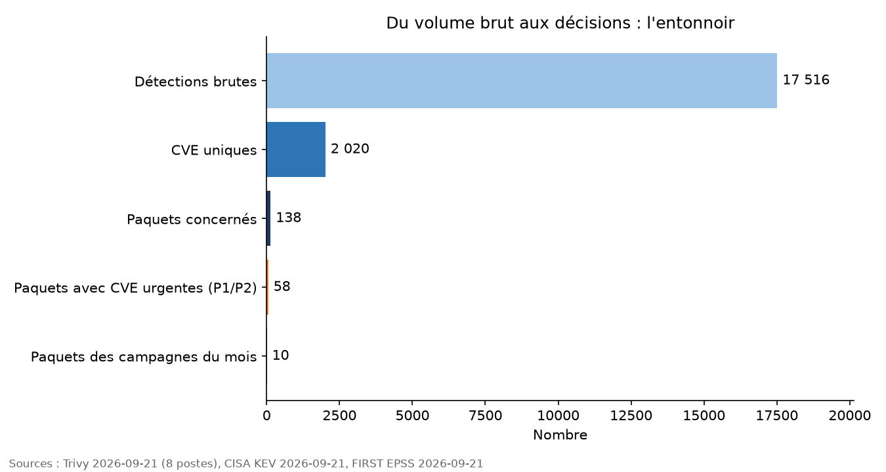
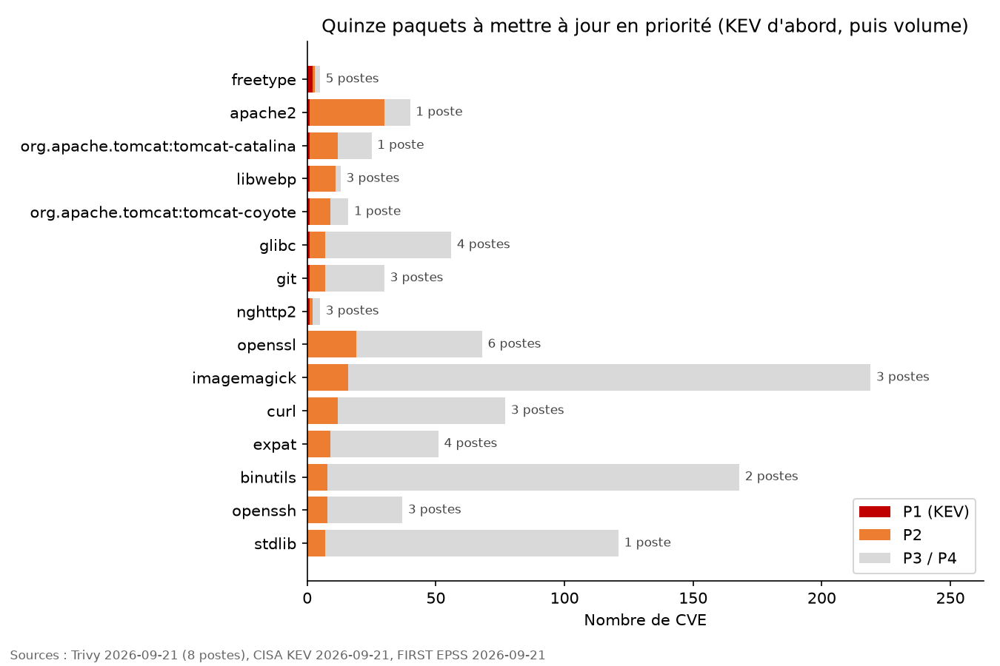

# rbvm-pipeline

Gestion des vulnérabilités de bout en bout sur un parc simulé : détections brutes (scans Trivy) → CVE uniques → enrichissement CISA KEV / FIRST EPSS → priorisation P1–P4 → applications à mettre à jour → campagnes. Puis validation de la règle sur l'ensemble du catalogue NVD.

**Chiffre clé** : Chiffre clé : sur un parc de 8 systèmes, 8 144 détections se ramènent à 2 020 CVE uniques et 138 paquets source ; mettre à jour les 10 premiers ferme 48 % des 241 CVE urgentes.




Deux files de traitement : une file **conformité**, triée par volume (postes × CVE), pour faire monter le taux de conformité de version ; une **voie rapide**, triée par exploitation réelle (KEV puis EPSS), pour ce qui ne peut pas attendre la prochaine campagne. Le RBVM décide l'ordre, ce n'est pas une étape en plus.

## Méthode

| Niveau | Règle | Action attendue |
|---|---|---|
| P1 Urgent | CVE dans le catalogue CISA KEV (exploitation avérée) | Corriger sous 15 jours |
| P2 Élevé | EPSS ≥ 0,10 ou (CVSS ≥ 9,0 et exploitable à distance) | Prochain cycle de patch |
| P3 Standard | CVSS ≥ 7,0 | Cycle trimestriel |
| P4 Différé | Le reste | Suivi |

Sources, datées dans `data/sources.json` à chaque exécution :
- NVD (CVSS, vecteur, produits touchés via CPE) : feeds JSON 2.0, https://nvd.nist.gov/vuln/data-feeds
- CISA KEV : https://www.cisa.gov/known-exploited-vulnerabilities-catalog
- FIRST EPSS : https://www.first.org/epss

## Exécution

Voir `PROCEDURE.md` pour le pas à pas complet.

```bash
python -m venv .venv && source .venv/bin/activate
pip install -r requirements.txt
make parc           # phase A : scans Trivy → classeur RBVM_parc.xlsx et graphiques
make catalogue      # phase B : NVD complète (≈ 600 Mo), validation de la règle
```

Ou pas à pas : `src/01_fetch_nvd.py [--mirror] [--from 2020]`, `02_fetch_kev.py`, `03_fetch_epss.py`, `04_catalogue.py`, `05_graphs_catalogue.py`.

Produit dans `output/` : `RBVM_parc.xlsx` (6 onglets : Synthese, Campagnes, Voie_rapide, Applications, CVE_uniques, Detections), `parc_stats.md`, `paquets.csv`, `voie_rapide.csv`, `campagnes.csv`, `entonnoir.png`, `top15_paquets.png` ; puis, phase B, `catalogue.parquet` (une ligne par CVE, enrichie et classée), `catalogue_stats.md` (les chiffres, datés), `charge_comparee.csv`, `produits.csv` (regroupement par éditeur/produit), `kev_enrichi.csv`, et quatre graphiques PNG.

## Limites

- EPSS est une probabilité d'exploitation à 30 jours, pas une certitude ; KEV est centré sur les produits en usage dans les administrations américaines.
- Le catalogue ne connaît ni l'exposition réseau ni la criticité métier : la grille est un point de départ, pas une décision.
- Le parc est simulé par des images de conteneurs scannées avec Trivy : de vraies CVE sur de vrais paquets, mais des systèmes Linux où la mise à jour est plus simple que sur un parc Windows ; l'intérêt est la méthode, pas l'échelle.
- Le CVSS retenu est v3.1, sinon v3.0, sinon v2 (colonne `cvss_version`) ; les CVE sans score sont conservées, jamais supprimées.

## Prochaines étapes

Brancher un inventaire réel (agent Wazuh Vulnerability Detection, export EDR) à la place des scans Trivy : le format d'entrée de `10_load_trivy.py` est le seul point à adapter. Ajouter l'exposition réseau (interne / exposé) et la criticité métier des postes dans la règle.
